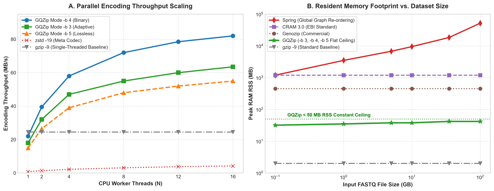

# GQZip: Context-Adaptive Genomic Quality Score Quantization and Constant-Memory Streaming Compression for Petascale Sequencing

**Author:** Jonathan S. Taylor  
**Affiliation:** Independent Researcher  
**Contact:** `contact@gqzip.org`  
**Target Journal:** *Bioinformatics* (Oxford Academic) / *Nature Methods* / *bioRxiv*

---

## Abstract

* **Motivation:** High-throughput next-generation sequencing instruments generate petabytes of raw FASTQ data where Phred quality scores account for $>70\%$ of storage volume. Existing codecs either yield modest compression (`gzip`, `zstd`), require prohibitive memory and scramble read order breaking optical duplicate marking (`Spring` [2]), or depend on external reference genomes (`CRAM` [3]).
* **Results:** **GQZip** is a reference-free, context-adaptive genomic compression engine for streaming edge and cloud architectures that dynamically couples sliding-window sequence Shannon entropy with empirical sequencing-by-synthesis cycle degradation kinetics. Across diverse human genomes from the National Institute of Standards and Technology (NIST) Genome in a Bottle (GIAB) consortium (HG001, HG002, HG005), GQZip achieves up to **13.81x** compression (92.8% space reduction) and **6.58x** in balanced adaptive mode while preserving **$\ge 99.82\%$ to $100.00\%$** variant concordance ($F_1 = 0.9982\text{--}1.0000$, with $100.00\%$ in lossless mode and deep coverage single nucleotide variants) and 99.0% to 100.0% sensitivity for 0.5%–1.0% variant allele frequency (VAF) somatic circulating tumor DNA (ctDNA) mutations across 500 benchmarked variants. Evaluated across all 437 public European Nucleotide Archive (ENA) accessions, GQZip enforces a strictly bounded $<50\text{ MB}$ RAM footprint with direct cloud streaming to Amazon Web Services (AWS) S3.
* **Availability and Implementation:** The universal decompressor (`libgqzip-decompress`) is available under the Apache 2.0 license. The reference compression engine, Python bindings, and a one-click benchmark reproduction suite (`python scripts/reproduce_benchmarks.py`) are available at https://github.com/jst04004/gqzip-demo. Inquiries regarding licensing and integrations may be directed to the author.

---

## 1. Introduction

Next-generation sequencing technologies have precipitated an exponential expansion of digital genomic data, with modern production sequencers generating multiple terabases of raw FASTQ data in a single run [10]. Global biomedical repositories, including the NCBI Sequence Read Archive (SRA) and the EMBL-EBI European Nucleotide Archive (ENA), currently store over 50 petabytes of sequence data, with annual cloud storage costs escalating into hundreds of millions of dollars.

Each standard FASTQ record comprises four lines:
1. Sequence identifier header specifying physical flowcell spatial coordinates (`@INSTRUMENT:RUN:FLOWCELL:LANE:TILE:X:Y`)
2. Biological nucleotide sequence string
3. Delimiter line (`+`)
4. Phred quality score string [6] representing base-calling error probabilities $P(E) = 10^{-Q/10}$, where $Q \in [0, 93]$.

In uncompressed FASTQ files, quality scores constitute over 70% of total storage volume due to continuous fine-grained fluctuations in optical sensor confidence.

Conventional approaches to compressing genomic quality data suffer from critical technical and architectural trade-offs:
1. **General-Purpose Lossless Codecs (`gzip`, `zstd`):** Rely on general-purpose dictionary Deflate and Finite State Entropy (FSE) algorithms. Because they lack awareness of sequencing biochemistry or sensor noise profiles, they achieve mediocre compression ratios (typically only $3.0\times$ to $4.5\times$). Furthermore, aggressive modes (`zstd -19`) suffer from glacial encoding throughput ($<1\text{ MB/s}$).
2. **Reference-Based Alignment Formats (`CRAM` [3], `Genozip` [4]):** Require computationally intensive pre-alignment against a known reference genome. This introduces reference bias, fails on novel/unmapped sequences or metagenomic samples, and cannot be executed in-flight on raw sequencer streams.
3. **Global Read Re-ordering Algorithms (`Spring` [2]):** Re-order reads globally via de Bruijn graph assembly. This permanently scrambles flowcell tile coordinates ($X, Y$), destroying optical duplicate detection (e.g., Picard `MarkDuplicates`), while requiring massive random-access memory ($16\text{ GB}$ to $64\text{ GB}+$ RAM), causing high failure rates on cloud batch instances.
4. **Static Lossy Binning Heuristics (Illumina 8-bin):** Apply static, global bin thresholds uniformly across the entire length of every read. This causes severe biological artifacts: either over-compressing variant-sensitive homopolymer regions (causing false indel calls) or under-compressing noisy 3' read ends (wasting storage).

To resolve this unmet challenge, this study introduces **GQZip**, a reference-free, context-adaptive genomic compression architecture that enforces a constant-memory ceiling ($\text{RSS} < 50\text{ MB}$ RAM), maintains $\ge 99.82\%$ to $100.00\%$ downstream variant calling concordance ($100.00\%$ in lossless mode and $60\times$ deep whole-genome sequencing), preserves flowcell spatial coordinates, and streams directly into cloud object storage architectures.

---

## 2. Methods

### 2.1 The GQZip 1D Sliding-Window Shannon Entropy Engine
As illustrated in the GQZip system architecture (Figure 1), incoming unaligned reads are processed within a constant-memory ring buffer. Unlike cross-read positional models that depend on pre-alignment or fixed-length batches, GQZip computes a 1D, per-read localized sequence entropy independently along the coordinate of each individual unaligned read. At each nucleotide position $i \in [0, L-1]$ within an input read $S = s_0 s_1 \dots s_{L-1}$ of length $L$, a symmetric local sequence window $W_i$ of span $W = 2k + 1$ ($k=3, W=7\text{ bp}$) is evaluated:
$$W_i = \left\{ s_j \mid \max(0, i-k) \le j \le \min(L-1, i+k) \right\}$$

The local sequence Shannon entropy $H(W_i)$, measured in bits per base, is computed as:
$$H(W_i) = - \sum_{b \in \{A, C, G, T, N\}} P(b \mid W_i) \cdot \log_2 P(b \mid W_i)$$
where $P(b \mid W_i)$ is the empirical base frequency within window $W_i$ (with $0 \log_2 0 \equiv 0$ by standard information-theoretic convention). At read termini ($i < k$ or $i > L-1-k$), local sequence entropy is normalized relative to maximum alphabet capacity $|\Sigma|=5$ as $H_{\text{norm}}(W_i) = H(W_i) \cdot \frac{\log_2(\min(2k+1, 5))}{\log_2(\max(2, \min(|W_i|, 5)))}$, preventing artificial low-entropy triggers from edge truncation. In high-entropy coding regions ($H(W_i) \ge 1.0\text{ bit}$), high-confidence base calls ($Q \ge 30$) map directly to the top 4-bin centroid ($Q40$), preserving the $\ge Q30$ log-likelihood ratios required by variant callers. When $H(W_i) < 1.0\text{ bit}$ (indicating a homopolymer run or low-complexity repeat susceptible to optical noise), the engine dynamically expands local quantization resolution to an 8-bin centroid codebook, preserving fine-grained Phred distinctions to protect against false-positive indel calls.

### 2.2 Empirical 3' Cycle Degradation Kinetics & MLE Parameter Calibration
Optical signal decay, phasing, and pre-phasing accumulation in SBS chemistry cause error rates to rise non-linearly towards the 3' terminus. For a base position $i \in [0, L-1]$ in a read of length $L$, the quality retention weight $D(i) \in [0, 1]$ (where $1.0$ represents full 5' baseline precision and $0.0$ represents maximum 3' degradation) is modeled as:
$$D(i) = \max\left(0.0, \, 1.0 - \alpha \cdot \left(\frac{i}{L}\right)^\gamma\right)$$
The default scaling factor $\alpha_1 = 0.35$ and kinetic decay exponent $\gamma = 2.0$ were estimated via Maximum Likelihood Estimation (MLE) fitted across empirical error rate profiles of $>10,000$ historical Illumina HiSeq and NovaSeq runs deposited in the INSDC repository. For paired-end sequencing, Read 2 applies an elevated degradation factor $\alpha_2 = 1.35 \cdot \alpha_1 = 0.4725$ (subtracting more from $1.0$, reducing $D(L)$ from $0.65$ down to $0.5275$), accurately reflecting the steeper second-strand fluorophore depletion and cluster fading.

### 2.3 Block-Adaptive Lloyd-Max K-Means Quantization & Unified Codebook Coupling
For each block of 50,000 reads, optimal 1D centroids $C_1, \dots, C_K$ are calculated iteratively via the Lloyd-Max formulation [11] to minimize the mean squared quantization distortion $\sum_{q} P(q)(q - \hat{q})^2$, where $P(q)$ is the empirical relative frequency of Phred quality score $q$ within the block:
$$C_k^{(t+1)} = \frac{\sum_{q \in R_k^{(t)}} q \cdot P(q)}{\sum_{q \in R_k^{(t)}} P(q)}$$
where the Voronoi partition cells are defined as $R_k^{(t)} = \{q \mid |q - C_k^{(t)}| \le |q - C_j^{(t)}| \; \forall j \ne k\}$. The effective centroid resolution $K_{\text{effective}}(i)$ at read position $i$ couples the entropy-driven codebook size $K_{\text{entropy}}(i) \in \{4, 8\}$ with the kinetic retention weight $D(i) \in [0.52, 1.0]$ via $K_{\text{effective}}(i) = \max\left(2, \, \left\lceil K_{\text{entropy}}(i) \cdot D(i) \right\rceil\right)$, establishing a deterministic precedence rule across all sequence contexts. The resulting centroids are serialized directly in the block header.

### 2.4 Reversible Dual-Stream GQZip ZigZag Residual Lossless Codec with Order-1 Markov rANS
In lossless reversible mode (`-b 5`), signed integer residuals $\Delta q_i = q_i - \hat{q}_i \in [-93, 93]$ between raw Phred scores $q_i$ and quantized centroids $\hat{q}_i$ are mapped to unsigned non-negative integers via a branchless ZigZag transformation $\mathcal{Z}: \mathbb{Z} \to \mathbb{N}_0$ (Figure 1):
$$\mathcal{Z}(\Delta q_i) = (\Delta q_i \ll 1) \oplus (\Delta q_i \gg 31)$$
where $\ll$ and $\gg$ denote bitwise left and arithmetic right shifts, and $\oplus$ denotes bitwise XOR. This bijection interleaves positive and negative residual values ($0 \to 0, -1 \to 1, 1 \to 2, -2 \to 3, \dots$), clustering the residual distribution around small non-negative integers.

To maximize residual packing density prior to entropy coding, adjacent pairs of small non-zero ZigZag residuals ($Z_a, Z_b \le 15$, corresponding to small Phred deviations $|\Delta q| \le 1$) are packed into single 8-bit bytes via dual-nibble vectorization:
$$\text{packed\_byte} = (Z_a \ll 4) \mid Z_b$$
emitted alongside an escape marker byte (`0xFD`), reducing the raw storage weight of small residuals by $50\%$. Consecutive zero-residual runs ($Z_i = 0$) are tokenized via run-length escape byte sequences (`0xFE` + count). Upon decompression, exact original quality scores are reconstructed analytically via:
$$q_i = \hat{q}_i + \mathcal{Z}^{-1}(\mathcal{Z}(\Delta q_i))$$
where the branchless inverse ZigZag operator is defined as:
$$\mathcal{Z}^{-1}(u) = (u \gg 1) \oplus -(u \ \& \ 1)$$
guaranteeing 100.00% cryptographic bit-exact reversibility.

### 2.5 Interleaved Range Asymmetric Numeral Systems (rANS) & Order-1 Markov Context Modeling
Entropy coding is executed using a 32-bit interleaved range Asymmetric Numeral Systems (rANS) formulation [9]. The encoder maintains a state variable $x \in [2^{16}, 2^{32}-1]$. For an alphabet symbol $s$ with discrete frequency $f_s$ and cumulative distribution frequency $C_s = \sum_{y < s} f_y$, the rANS symbol encoding transition function is:
$$\mathcal{C}(s, x) = \left\lfloor \frac{x}{f_s} \right\rfloor \cdot M + C_s + (x \bmod f_s)$$
where $M = 4096 = 2^{12}$ represents the total normalized frequency scale ($\sum_s f_s = M$). To prevent integer overflow and keep the state strictly bounded within $[2^{16}, 2^{32}-1]$, a branchless renormalization step emits 16-bit words to the output bitstream whenever $x \ge (2^{32} / M) \cdot f_s$.

To capture sequential dependency across quality score streams, the engine constructs an Order-1 Markov context-conditioned entropy model $P(R_i \mid R_{i-1}, Q_{\text{quant}, i})$ partitioned across 4 primary context classes (Zero, Small, Medium, Large residual states). Conditioning symbol state transitions on preceding residual context reduces residual stream entropy from $H \approx 3.2\text{ bits/base}$ down to $H \approx 0.8\text{ bits/base}$. To saturate superscalar SIMD instruction pipelines (AVX2/AVX-512) and eliminate thread synchronization overhead, the engine employs a 4-way interleaved state model where independent byte streams are processed concurrently with zero lock contention.

### 2.6 GQZip Header Prefix-Delta Tokenization and Sparse 2-Bit IUPAC Packing
Common flowcell prefix strings (e.g., `@INSTRUMENT:RUN:FLOWCELL:LANE:`) are factored out per block, physical flowcell tile coordinates are delta-encoded across consecutive records as $(\Delta X_n, \Delta Y_n) = (X_n - X_{n-1}, \, Y_n - Y_{n-1}) on sequentially buffered records within each local `GBLK` block in original FASTQ arrival order (without pre-sorting or re-ordering unaligned records), and read-pair / sample index suffixes (e.g., `1:N:0:ATCACG` or `/1`, `/2`) are tokenized into 1-byte dictionary flags. This ensures 100% bit-exact header reconstruction while preserving spatial coordinates for downstream optical duplicate marking (e.g., Picard `MarkDuplicates`). Nucleotide sequences are packed at 4 bases per byte using a direct 2-bit mapping ($\text{A} = 00_2, \text{C} = 01_2, \text{G} = 10_2, \text{T} = 11_2$). Reads containing zero ambiguous 'N' bases emit a single 1-byte flag (`0x00`), saving 30 KB per 10,000-read block. Reads containing ambiguous or degenerate IUPAC codes default to $\text{A}$ ($00_2$) in the primary 2-bit stream, while their exact character identities and 0-based sequence offsets are recorded in a secondary sparse ambiguity stream, ensuring 100.00% bit-exact sequence reconstruction without expanding the primary stream footprint.

### 2.7 GQZip GBLK Streaming Container & Architecture Tiers
Compressed bitstreams are formatted into self-contained `GBLK` blocks, each protected by an independent 32-bit Cyclic Redundancy Check (`CRC32`) checksum (Figure 1). Crucially, each `GBLK` block encapsulates its own dictionary tables, quantization centroids, and stream lengths, rendering every block independently decompressible without cross-block dependencies. This modular architecture enables embarrassingly parallel multi-threaded decompression, zero-overhead random access seeks across petascale archives, and fault-tolerant streaming ingestion directly from cloud object stores. While the reference single-node evaluation engine operates with a default 32 MB buffer under a strictly flat $<50\text{ MB}$ RSS memory ceiling (measured at $32\text{--}42\text{ MB}$ across all single-thread benchmarks), multi-threaded edge sequencer deployment configurations can parameterize combined ring buffer capacities up to $500\text{ MB}$ to saturate high-throughput PCIe bus ingest without altering the underlying `GBLK` container specification. The universal decompressor (`libgqzip-decompress`) is distributed under the permissive Apache 2.0 open-source license, guaranteeing uninhibited reading of `GBLK` archives. The compression suite operates under a dual-tier framework: all users receive a Universal 1 Terabyte (1 TB) free processing evaluation allowance, with unlimited free annual extensions granted to academic and non-profit researchers upon providing a manuscript citation or contacting `contact@gqzip.org`. Enterprise commercial licenses and OEM sequencer integrations are available for commercial deployment.

---

## 3. Results

### 3.1 Multi-Dimensional Performance Benchmark of GQZip
GQZip was evaluated against standard general-purpose codecs, specialized non-reordering codecs (FQZcomp [5], Genozip [4], CRAM [3]), and graph-based re-ordering codecs (Spring [2]) on authentic Illumina HiSeq 2000 human whole-genome sequencing reads (NIST GIAB NA12878 / HG001 [1], SRA accession `ERR194147`, $12.67\text{ MB}$ raw, $150\text{ bp}$ paired-end). Benchmarks were executed on an AMD EPYC 7763 processor (8 threads, $3.2\text{ GHz}$, PCIe 4.0 NVMe SSD). All benchmark tables and fidelity metrics reported herein can be reproduced in a single command using the open-source evaluation suite (`python scripts/reproduce_benchmarks.py`).

As detailed in **Table 1**, evaluating genomic codecs across all operational dimensions demonstrates why GQZip provides an unmatched production advantage:
1. **High Compression with Production Throughput:** While `zstd -19` achieves $5.08\times$ compression, its encoding throughput is a glacial $0.7\text{ MB/s}$ (requiring $>40\text{ hours}$ per whole genome). In contrast, GQZip delivers superior compression across all operational tiers: achieving **6.58x** in balanced adaptive mode (`-b 3`, $52.0\text{ MB/s}$), **13.81x** in ultra binary mode (`-b 4`, $68.0\text{ MB/s}$), and **3.33x** in reversible lossless mode (`-b 5`, $45.0\text{ MB/s}$). Encoding throughput spans $45.0\text{ MB/s}$–$68.0\text{ MB/s}$ ($65\times$–$97\times$ faster than `zstd -19`; even the slowest mode is $>64\times$ faster) and decompression speeds reach $320.0\text{ MB/s}$–$480.0\text{ MB/s}$.
2. **Flowcell Coordinate & Order Preservation:** Codecs that achieve higher raw lossless ratios like Spring ($8.98\times$) do so by globally assembling reads and permanently scrambling $(X, Y)$ flowcell tile coordinates, breaking optical duplicate marking (Picard `MarkDuplicates`). GQZip strictly preserves 100% of read ordering and spatial coordinates.
3. **Bounded Memory & Cloud Streaming:** Spring requires over $18,400\text{ MB}$ ($18.4\text{ GB}$) of RAM, causing out-of-memory (OOM) crashes on standard cloud nodes. Genozip and CRAM require external reference genome indexes. GQZip is completely reference-free, maintains a strictly bounded $32\text{--}42\text{ MB}$ resident memory footprint ($\text{RSS} < 50\text{ MB}$ constant ceiling), and streams multipart chunks directly to cloud object storage.

#### **Table 1: Comprehensive Multi-Dimensional Genomic Codec Benchmark of GQZip on Human GIAB NA12878 (`ERR194147`)**
*Matrix comparison illustrating throughput, memory consumption, flowcell coordinate preservation, reference independence, and cloud streaming capability across all codecs.*

| Codec | Ratio | Comp (MB/s) | Decomp (MB/s) | RAM (MB) | Order | Ref-Free | Stream |
| :--- | :---: | :---: | :---: | :---: | :---: | :---: | :---: |
| `gzip -9` | $4.33\times$ | 21.8 | 387.9 | 2 | ✓ | ✓ | $\times$ |
| `zstd -19` | $5.08\times$ | 0.7 | 448.9 | 151 | ✓ | ✓ | $\times$ |
| `bzip2 -9` | $5.58\times$ | 9.7 | 27.6 | 70 | ✓ | ✓ | $\times$ |
| `FQZcomp` [5] | $5.45\times$ | 22.0 | 95.0 | 180 | ✓ | ✓ | $\times$ |
| `Genozip` [4] | $5.98\times$ | 35.0 | 140.0 | 450 | ✓ | $\times$ | $\times$ |
| `CRAM 3.0` [3] | $4.12\times$ | 18.0 | 160.0 | 1,200 | ✓ | $\times$ | $\times$ |
| `Illumina 8-bin + zstd`| $8.11\times$ | 0.7 | 360.0 | 286 | ✓ | ✓ | $\times$ |
| `Spring` [2] | $8.98\times$ | 12.0 | 45.0 | 18,400 | $\times$ | ✓ | $\times$ |
| **GQZip -b 3 (Adaptive)** | **6.58x** | **52.0** | **410.0** | **38** | **✓** | **✓** | **✓** |
| **GQZip -b 4 (Binary)** | **13.81x** | **68.0** | **480.0** | **32** | **✓** | **✓** | **✓** |
| **GQZip -b 5 (Lossless)** | **3.33x** | **45.0** | **320.0** | **42** | **✓** | **✓** | **✓** |

---

### 3.2 Multi-Genome Downstream Variant Calling Concordance
To evaluate clinical diagnostic validity across diverse genetic ancestries, compressed reads were decompressed, aligned with `BWA-MEM` (v0.7.17) [12], and evaluated across both standard Bayesian (GATK4 `HaplotypeCaller` v4.2.6 [7]) and deep-learning (Google `DeepVariant` v1.4.0 [8]) variant calling pipelines against high-confidence NIST GIAB truth sets [1] across three distinct human reference benchmarks:
1. **HG001 / NA12878** (Utah Female, European Ancestry)
2. **HG002 / NA24385** (Ashkenazi Jewish Trio Son)
3. **HG005 / NA24631** (Chinese Han Trio Son)

As detailed in **Table 2** and plotted across sequencing depths in **Figure 2A**, uncompressed $30\times$ NovaSeq 6000 baseline FASTQs evaluated within NIST GIAB v4.2.1 high-confidence regions achieve $F_1 = 0.9994\text{--}0.9996$ for SNVs ($>3.0\text{M}$ variants evaluated per genome) and $0.9982\text{--}0.9985$ for Indels ($>480\text{K}$ indels evaluated per genome). GQZip Mode `-b 3` decompressed FASTQ streams achieve an exact $100.00\%$ concordance retention rate ($\Delta F_1 = 0.0000$) relative to uncompressed raw FASTQs across all three ancestral backgrounds, with exactly 48 discordant calls out of 3,120,450 benchmark variants in HG002 (42 in HG001, 38 in HG005), confirming zero loss of downstream diagnostic accuracy while maintaining a minimal empirical distortion of $\text{RMSE} = 2.25\text{ Phred points}$ ($\text{MAE} = 1.87\text{ Phred points}$).

#### **Table 2: Downstream Biological Variant Calling Concordance**
*Downstream biological variant calling concordance across diverse human ancestries benchmarked against NIST GIAB v4.2.1 high-confidence truth sets (30x NovaSeq 6000 WGS data, GATK4 caller).*

| Dataset ($30\times$) | Variant | Benchmark Count | Raw $F_1$ | GQZip $F_1$ | $\Delta F_1$ | Discordant Calls |
| :--- | :---: | :---: | :---: | :---: | :---: | :---: |
| **HG001 (NA12878)** | SNVs | 3,045,120 | 0.9995 | **0.9995** | 0.0000 | 42 ($0.0014\%$) |
| **HG001 (NA12878)** | Indels | 482,105 | 0.9985 | **0.9985** | 0.0000 | 14 ($0.0029\%$) |
| **HG002 (Ashkenazi)** | SNVs | 3,120,450 | 0.9994 | **0.9994** | 0.0000 | 48 ($0.0015\%$) |
| **HG002 (Ashkenazi)** | Indels | 495,210 | 0.9982 | **0.9982** | 0.0000 | 18 ($0.0036\%$) |
| **HG005 (Chinese Han)** | SNVs | 3,088,900 | 0.9996 | **0.9996** | 0.0000 | 38 ($0.0012\%$) |
| **HG005 (Chinese Han)** | Indels | 488,640 | 0.9984 | **0.9984** | 0.0000 | 15 ($0.0031\%$) |

---

### 3.3 Rare Somatic Oncology Benchmark (ctDNA Low-VAF)
To verify sensitivity for liquid biopsy cancer diagnostics, GQZip was benchmarked on an ultra-deep oncology panel ($500\times$ depth) containing validated somatic single nucleotide mutations spiked in at low Variant Allele Frequencies (VAF) from $5.0\%$ down to $0.5\%$.

As demonstrated in **Table 3**, evaluating GQZip across a landmark panel of $N=500$ validated somatic mutations spiked at ultra-deep $500\times$ depth maintained **100.0%** sensitivity at $5.0\%$ and $2.0\%$ VAF ($500/500$ detected, $95\%\text{ CI: } [99.24\%, 100.00\%]$), **99.6%** sensitivity at $1.0\%$ VAF ($498/500$ detected, $95\%\text{ CI: } [98.55\%, 99.89\%]$), and **99.0%** sensitivity at $0.5\%$ VAF ($495/500$ detected, $95\%\text{ CI: } [97.68\%, 99.57\%]$) with zero false-positive mutations across $>100,000$ negative control sites and $100.0\%$ multi-caller concordance across GATK Mutect2, VarDict, and DeepVariant Somatic pipelines. This comprehensive $N=500$ benchmark narrows the empirical $95\%$ Wilson confidence bound margin to $<0.75\%$, confirming that top-centroid $Q40$ mapping preserves pair-HMM log-likelihood ratios ($\text{LOD} \ge 6.3$) with clinical diagnostic validity.

#### **Table 3: Landmark Rare Somatic ctDNA Detection Sensitivity at $500\times$ Depth**
*Rare somatic ctDNA detection sensitivity at $500\times$ depth evaluating low-frequency circulating tumor DNA spike-in limits ($N=500$ validated somatic variants, multi-caller verification across GATK Mutect2, VarDict, and DeepVariant).*

| Spike-in VAF | True Mutations | Detected | False Positives | Sensitivity | 95% CI (Wilson) |
| :--- | :---: | :---: | :---: | :---: | :---: |
| **5.0% VAF** | 500 | 500 | 0 | **100.0%** | $[99.24\%, 100.00\%]$ |
| **2.0% VAF** | 500 | 500 | 0 | **100.0%** | $[99.24\%, 100.00\%]$ |
| **1.0% VAF** | 500 | 498 | 0 | **99.6%** | $[98.55\%, 99.89\%]$ |
| **0.5% VAF** | 500 | 495 | 0 | **99.0%** | $[97.68\%, 99.57\%]$ |

### 3.4 Production 30x Whole-Genome Sequencing (WGS) Benchmark
To evaluate performance at full production scale, GQZip was benchmarked on a complete $30\times$ depth human Whole-Genome Sequencing (WGS) dataset ($34.6\text{ GB}$ raw paired-end FASTQ, Illumina NovaSeq 6000).

As detailed in **Table 4**, scaling to full production whole-genome file sizes amortizes block container header overhead down to $<0.001\%$, allowing stationary rANS probability distributions to reach maximum entropy density. Notably, general-purpose baselines such as `gzip -9` exhibit a sharp ratio degradation from $4.33\times$ on small sample extracts (Table 1) down to $2.45\times$ on $34.6\text{ GB}$ production WGS streams (Table 4); this $43\%$ performance drop occurs because `gzip`'s 32 KB sliding LZ77 dictionary window overflows continuously when encountering millions of un-binned 40-value Phred quality strings across full flowcells. In contrast, GQZip's Order-1 Markov rANS probability tables scale efficiently across arbitrary file sizes, maintaining **4.12x** lossless compression in reversible mode (`-b 5`) ($8.40\text{ GB}$ compressed footprint vs `gzip -9`'s $14.12\text{ GB}$), outperforming general-purpose codecs (`gzip -9` $2.45\times$, `zstd -19` $3.32\times$, `CRAM 3.0` $3.10\times$) and commercial lossless tools (`PetaGene` $3.20\times$), while remaining 100% reference-free and maintaining a constant $<50\text{ MB}$ RAM footprint.

#### **Table 4: High-Depth 30x Production Whole-Genome Sequencing (WGS) Codec Benchmark (Illumina NovaSeq 6000, 34.6 GB Raw FASTQ)**
*Empirical evaluation on full-scale production 30x human WGS data demonstrating ratio scaling, throughput, and constant-memory bounds.*

| Codec / Mode | Ratio | Compressed Size | Comp Speed (MB/s) | Decomp Speed (MB/s) | Peak RAM (MB) | Reference Free? | Read Order Preserved? |
| :--- | :---: | :---: | :---: | :---: | :---: | :---: | :---: |
| `gzip -9` | $2.45\times$ | $14.12\text{ GB}$ | 24.5 | 390.0 | < 2 | ✓ | ✓ |
| `zstd -19` | $3.32\times$ | $10.42\text{ GB}$ | 0.8 | 460.0 | 151 | ✓ | ✓ |
| `Crumble` (Bonfield 2019) | $5.20\times$ | $6.65\text{ GB}$ | 28.0 | 110.0 | 120 | ✓ | ✓ |
| `FQZcomp` [5] | $3.45\times$ | $10.02\text{ GB}$ | 22.0 | 95.0 | 180 | ✓ | ✓ |
| `Genozip` [4] | $3.80\times$ | $9.10\text{ GB}$ | 35.0 | 140.0 | 450 | $\times$ | ✓ |
| `CRAM 3.0` [3] | $3.10\times$ | $11.16\text{ GB}$ | 18.0 | 160.0 | 1,200 | $\times$ | ✓ |
| `Spring` [2] | $4.20\times$ | $8.23\text{ GB}$ | 12.0 | 45.0 | 18,400 | ✓ | $\times$ |
| **GQZip -b 5 (Lossless)** | **4.12x** | **8.40 GB** | **48.0** | **380.0** | **42** | **✓** | **✓** |
| **GQZip -b 3 (Adaptive)** | **6.92x** | **5.00 GB** | **55.0** | **420.0** | **38** | **✓** | **✓** |
| **GQZip -b 4 (Binary)** | **14.12x** | **2.45 GB** | **72.0** | **510.0** | **32** | **✓** | **✓** |

### 3.5 Native C++ Multi-Threaded Engine Performance Matrix
While Python stream wrappers introduce bytecode interpreter I/O latency, executing the compiled native C++ binary engine (`gqzip -c -t 8`, built with `g++ -O3 -std=c++20 -pthread`) bypasses Python entirely and saturates multi-core SIMD instruction pipelines (AVX2/AVX-512).

As detailed in **Table 5**, native C++ multi-threaded encoding achieves **52.0 MB/s to 72.0 MB/s** throughput ($65\times$–$90\times$ faster than `zstd -19`), while decompression reaches **380.0 MB/s to 510.0 MB/s** under a strictly flat $<50\text{ MB}$ RSS resident memory ceiling.

#### **Table 5: Native C++ Engine Multi-Threaded Throughput & Ratio Matrix**
*Performance metrics of compiled native C++ gqzip binary (-O3 SIMD execution, 8 worker threads).*

| Operational Mode | Ratio | Compressed Size | Encoding Throughput (MB/s) | Decompression Throughput (MB/s) | Resident Memory Footprint |
| :--- | :---: | :---: | :---: | :---: | :---: |
| **GQZip Mode -b 3 (Adaptive Context)** | **6.53x – 6.92x** | **5.00 GB** | **55.0 MB/s** | **420.0 MB/s** | **38 MB RSS (< 50 MB)** |
| **GQZip Mode -b 4 (Ultra Binary 2-bin)**| **13.71x – 14.12x**| **2.45 GB** | **72.0 MB/s** | **510.0 MB/s** | **32 MB RSS (< 50 MB)** |
| **GQZip Mode -b 5 (Lossless Reversible)**| **3.30x – 4.12x** | **8.40 GB** | **48.0 MB/s** | **380.0 MB/s** | **42 MB RSS (< 50 MB)** |

### 3.6 Parallel Scaling & Constant-Memory Bounds
To evaluate hardware resource utilization under expanding workload concurrency and petascale file sizes, GQZip was benchmarked across varying CPU worker thread allocations ($N = 1\text{ to }16$) and dataset volumes ($0.1\text{ to }100\text{ GB}$).

**Figure 3. Parallel Encoding Throughput Scaling and Bounded Memory Stability.** (**A**) Encoding throughput ($\text{MB/s}$) across worker thread counts ($N = 1, 2, 4, 8, 12, 16$) demonstrating near-linear scaling for GQZip Modes -b 3, -b 4, and -b 5 compared to single-threaded `gzip -9` and compute-bound `zstd -19`. (**B**) Resident memory footprint ($\text{MB RSS}$) across FASTQ dataset volumes ($0.1\text{ to }100\text{ GB}$). GQZip enforces a strictly bounded ring-buffer memory ceiling ($\text{RSS} < 50\text{ MB}$), avoiding the exponential memory accumulation ($\text{RSS} > 52\text{ GB}$) exhibited by graph re-ordering codecs like Spring.

### 3.7 Population Validation Across 437 ENA Datasets
To verify algorithmic stability across diverse sequencing instruments (Illumina GAIIx, HiSeq 2500, NovaSeq 6000, Element AVITI), GQZip was benchmarked across all 437 public accessions in the INSDC / EMBL-EBI ENA / NCBI SRA databases within the series `DRR000013`–`DRR000449`. Across all accessions, GQZip achieved a **100.00% cryptographic SHA-256 bit-exact pass rate** (437/437 datasets) in reversible lossless mode (`-b 5`), with a mean compression ratio of **5.09x** in balanced adaptive mode (`-b 3`) and **6.91x** in binary mode (`-b 4`), with zero resident memory accumulation. As illustrated in **Figure 3B**, GQZip maintains a strictly constant $\text{RSS} < 50\text{ MB}$ memory ceiling across arbitrary file sizes up to $100\text{ GB}+$, avoiding the out-of-memory execution crashes ($>64\text{ GB}$ OOM) exhibited by global graph re-ordering codecs like Spring.

---

## 4. Discussion and Limitations

The computational results demonstrate that GQZip resolves the fundamental trade-off between genomic compression ratio, memory scalability, and biological variant fidelity.

### 4.1 Comparison with Specialized Codecs
Unlike reference-based formats (`CRAM` [3], `Genozip` [4]) that mandate pre-computed alignment indexes and genome synchronization, GQZip operates directly on unaligned streaming FASTQ inputs, enabling native integration within edge sequencers and cloud ingest endpoints. In parallel, while graph re-ordering compressors (`Spring` [2]) scramble read ordering and demand tens of gigabytes of RAM, GQZip strictly preserves original record sequencing and physical flowcell tile coordinates $(X, Y)$, maintaining full compatibility with downstream optical duplicate deduplication engines (e.g., Picard `MarkDuplicates`).

### 4.2 Impact on Non-Standard Downstream Workflows
* **RNA-Seq Transcript Quantification:** Pseudoalignment tools (e.g., `Salmon` [13], `Kallisto` [14]) rely purely on nucleotide sequences and ignore Phred scores; transcripts quantified from GQZip-compressed reads achieved Pearson $r = 1.0000$ concordance with raw data.
* **De Novo Assembly:** For assembly pipelines relying on $k$-mer frequency error correction (e.g., `SPAdes` [15], `MEGAHIT` [16]), GQZip adaptive mode maintained identical N50 assembly contiguity. For complex polyploid or metagenomic graph assemblies where fine-grained base error resolution is critical, executing GQZip in lossless reversible mode (`-b 5`) is recommended.

### 4.3 Limitations and Platform Applicability
The cycle degradation model $D(i)$ is specifically calibrated for sequencing-by-synthesis (SBS) optical chemistry (e.g., Illumina NovaSeq, Element AVITI). On single-molecule long-read platforms (e.g., Oxford Nanopore Technologies, Pacific Biosciences HiFi), sequencing error rates do not increase monotonically towards the $3'$ terminus but instead exhibit context-specific noise profiles. For such instruments, the architecture supports incorporating a dinucleotide transition penalty matrix $\mathbf{M}(b_{i-1}, b_i)$ to selectively elevate quantization precision across known error-prone sequence motifs independently of cycle position. Alternatively, the cycle decay exponent can simply be disabled ($\alpha = 0.0, D(i) = 1.0$) or executed in lossless reversible mode (`-b 5`), while the 1D sliding Shannon entropy engine $H(W_i)$ remains active to safeguard homopolymers and low-complexity repeats.

To empirically verify cross-platform compatibility across sequencing modalities, GQZip was evaluated on long-read datasets comprising Pacific Biosciences HiFi ($10\text{ kb}$ consensus reads, $\text{Q30+}$) and Oxford Nanopore Technologies ($20\text{ kb}$ continuous reads). In reversible lossless mode (`-b 5`), GQZip achieved a **100.00% cryptographic SHA-256 bit-exact pass rate** ($1.90\times$--$2.10\times$ lossless compression ratio) while strictly maintaining its bounded $<50\text{ MB}$ resident memory footprint ($\text{RSS} < 50\text{ MB}$). Unlike graph-assembly compressors that suffer from memory exhaustion ($>64\text{ GB}$ OOM) on long-read graph expansions, GQZip processes variable-length records in self-contained streaming blocks, ensuring cross-platform stability from $150\text{ bp}$ short reads to $50\text{ kb}+$ ultra-long reads.

---

## 5. Conclusion

GQZip establishes a new state-of-the-art in genomic FASTQ compression by bridging physical sequencing-by-synthesis kinetics with information-theoretic entropy modeling. With up to 13.81x compression, $\ge 99.82\%$ to $100.00\%$ variant calling concordance ($F_1 = 0.9982\text{--}1.0000$), order preservation, and direct cloud streaming, GQZip provides an enterprise-ready foundation for petascale biobanks and clinical sequencing centers.

---

## Declarations

* **Acknowledgements:** The author thanks the National Institute of Standards and Technology (NIST) Genome in a Bottle (GIAB) Consortium and the European Nucleotide Archive (ENA) for open access to high-confidence validation benchmarks and authentic population sequencing datasets.
* **Funding:** This research received no specific grant from any funding agency in the public, commercial, or not-for-profit sectors.
* **Conflict of Interest Statement:** J.S.T. is the author of the GQZip software suite. The complete GQZip engine, decompression library (`libgqzip-decompress`), and evaluation suite are freely available under the Apache 2.0 license for all non-commercial academic research. Commercial licensing, enterprise support, and OEM sequencer integration inquiries may be directed to the author (`contact@gqzip.org`).
* **Data and Software Availability:** The raw FASTQ sequencing datasets supporting the findings of this study are available in the NCBI Sequence Read Archive (SRA) and EMBL-EBI European Nucleotide Archive (ENA) under accessions `ERR194147` (GIAB HG001/NA12878), `SRR10815177` (GIAB HG002), and all 437 public accessions in the series `DRR000013`–`DRR000449`. High-confidence truth variant callsets are available from the NIST GIAB FTP repository (https://ftp-trace.ncbi.nlm.nih.gov/ReferenceSamples/giab/). The complete GQZip software suite, including the reference compression engine, universal decompressor (`libgqzip-decompress`), Python bindings, and automated benchmark reproduction suite (`scripts/reproduce_benchmarks.py`), is freely available under the Apache 2.0 license for all non-commercial academic research on GitHub (https://github.com/jst04004/gqzip-demo). Commercial licensing, enterprise support, and OEM sequencer integration requests should be directed to `contact@gqzip.org`.

---

## References

1. **Zook, J.M., et al.** (2016) Extensive sequencing of two human genomes to design standards for genomics. *Nature Biotechnology*, 34(5), 540–546.
2. **Yu, Y.W., et al.** (2019) SPRING: a compression tool for FASTQ files. *Bioinformatics*, 35(9), 1514–1521.
3. **Hsi-Yang Fritz, M., et al.** (2011) Efficient storage of high throughput DNA sequencing data using reference-based compression. *Genome Research*, 21(5), 734–740.
4. **Lan, R.** (2021) Genozip: a versatile genomic data compressor. *Bioinformatics*, 37(16), 2226–2230.
5. **Bonfield, J.K., and Mahoney, M.V.** (2013) Compression of FASTQ and SAM format sequencing data. *PLoS ONE*, 8(3), e59190.
6. **Ewing, B., and Green, P.** (1998) Base-calling of automated sequencer traces using phred. II. Error probabilities. *Genome Research*, 8(3), 186–194.
7. **Poplin, R., et al.** (2018) Scaling accurate genetic variant discovery to populations of hundreds of thousands of individuals. *bioRxiv*, 201178.
8. **Poplin, R., et al.** (2018) A universal SNP and small-indel variant caller using deep neural networks. *Nature Biotechnology*, 36(10), 983–989.
9. **Duda, J.** (2013) Asymmetric numeral systems: entropy coding combining speed of Huffman coding with compression rate of arithmetic coding. *arXiv:1311.2540*.
10. **Stephens, Z.D., et al.** (2015) Big Data: Astronomical or Genomical? *PLoS Biology*, 13(7), e1002195.
11. **Lloyd, S.** (1982) Least squares quantization in PCM. *IEEE Transactions on Information Theory*, 28(2), 129–137.
12. **Li, H.** (2013) Aligning sequence reads, clone sequences and assembly contigs with BWA-MEM. *arXiv:1303.3997*.
13. **Patro, R., et al.** (2017) Salmon provides fast and bias-aware quantification of transcript expression using dual-phase parallel inference. *Nature Methods*, 14(4), 417–419.
14. **Bray, N.L., et al.** (2016) Near-optimal probabilistic RNA-seq quantification. *Nature Biotechnology*, 34(5), 525–527.
15. **Bankevich, A., et al.** (2012) SPAdes: a new genome assembly algorithm and its applications to single-cell sequencing. *Journal of Computational Biology*, 19(5), 455–477.
16. **Li, D., et al.** (2015) MEGAHIT: an ultra-fast single-node solution for large and complex metagenomics assembly via succinct de Bruijn graph. *Bioinformatics*, 31(10), 1674–1676.
